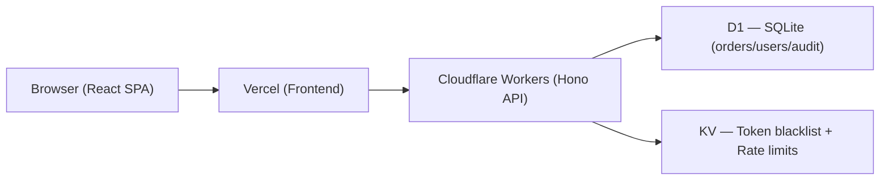

# TradeDesk

A production-grade, full-stack trade order management platform built for the Primetrade.ai internship assignment. TradeDesk demonstrates real engineering maturity across the entire stack: a stateless JWT-authenticated REST API on Cloudflare's serverless edge, role-based access control, an order state machine with immutable audit logs, and a Bloomberg-inspired "Precision Terminal" React frontend.

**Why this stack?** Cloudflare Workers offer zero cold-start serverless compute at 300+ edge locations globally. D1 gives us SQLite-on-edge without managing a database. KV enables sub-millisecond token blacklisting and rate limit counters. Hono.js is the fastest Workers-compatible web framework. React + Vite + shadcn/ui delivers a production-ready frontend with a design system that communicates trust to professional traders.

---

## Architecture



---

## Prerequisites

- Node.js 18+
- Wrangler CLI v3: `npm install -g wrangler`
- Cloudflare account (free tier works)
- Vercel CLI (optional for deploy): `npm install -g vercel`

---

## Local Setup

Run these commands in order:

```bash
# 1. Clone and enter the repo
git clone <repo-url>

# 2. Create Cloudflare D1 database
wrangler d1 create tradedesk-db
# → Copy the database_id printed and paste into backend/wrangler.toml

# 3. Create Cloudflare KV namespace
wrangler kv:namespace create TRADEDESK_KV
# → Copy the id printed and paste into backend/wrangler.toml

# 4. Run D1 migrations locally
wrangler d1 execute tradedesk-db --local --file=backend/src/db/schema.sql

# 5. Set JWT secret (stored encrypted in Cloudflare)
cd backend
wrangler secret put JWT_SECRET
# → Enter a strong random secret (e.g. openssl rand -base64 32)

# 6. Start the API Worker (local dev)
wrangler dev

# 7. In a new terminal: set up and start the frontend
cd frontend
cp .env.example .env.local
npm install
npm run dev
```

---

## Seed Admin User

Run this after D1 migration. Replace `<bcrypt-hash>` with a bcrypt hash of your chosen password (rounds=12):

```bash
# Generate hash first:
node -e "const b=require('bcryptjs'); b.hash('AdminPass123', 12).then(console.log)"

# Then insert:
wrangler d1 execute tradedesk-db --local --command "INSERT INTO users (id, email, password, role) VALUES (lower(hex(randomblob(16))), 'admin@tradedesk.dev', '<bcrypt-hash>', 'admin');"
```

---

## Environment Variables

| Variable | Location | Required | Description | Example |
|---|---|---|---|---|
| `VITE_API_URL` | `frontend/.env.local` | ✅ | Base URL of the Worker API | `http://localhost:8787` |
| `JWT_SECRET` | Cloudflare secret (wrangler) | ✅ | HMAC-SHA256 signing key for JWT | Random 32-byte base64 |
| `JWT_EXPIRY` | `backend/wrangler.toml` [vars] | ✅ | Token TTL in seconds | `86400` |
| `DB` | `backend/wrangler.toml` binding | ✅ | D1 database binding | — |
| `KV` | `backend/wrangler.toml` binding | ✅ | KV namespace binding | — |

---

## Deployment

**API (Cloudflare Workers):**
```bash
cd backend
wrangler d1 execute tradedesk-db --file=src/db/schema.sql
wrangler deploy
```

**Frontend (Vercel):**
```bash
cd frontend
vercel --prod
# Set VITE_API_URL in Vercel dashboard → Project Settings → Environment Variables
```

---

## API Documentation

Swagger UI is served at:
- Local: `http://localhost:8787/api/docs`
- Production: `https://tradedesk-api.<subdomain>.workers.dev/api/docs`
