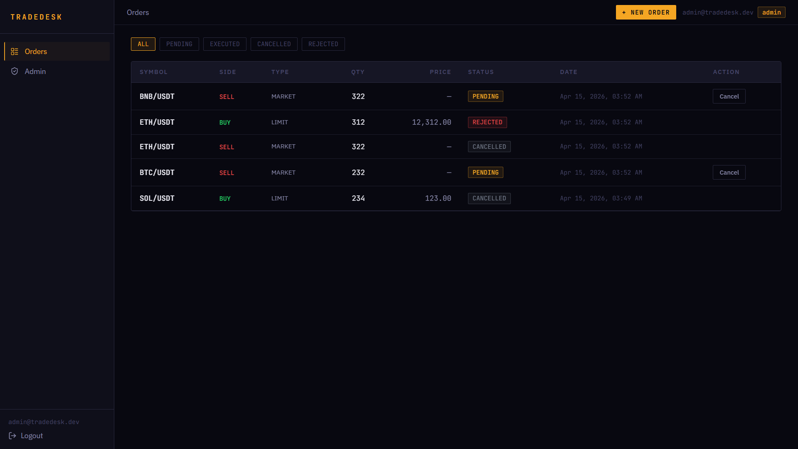
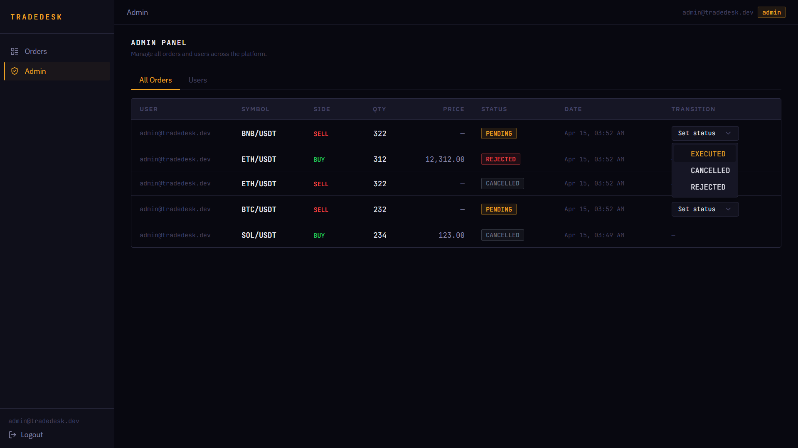
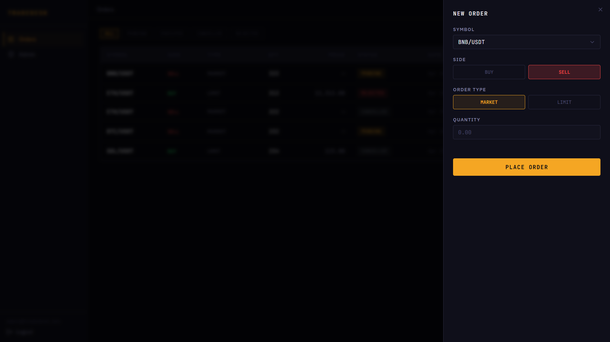
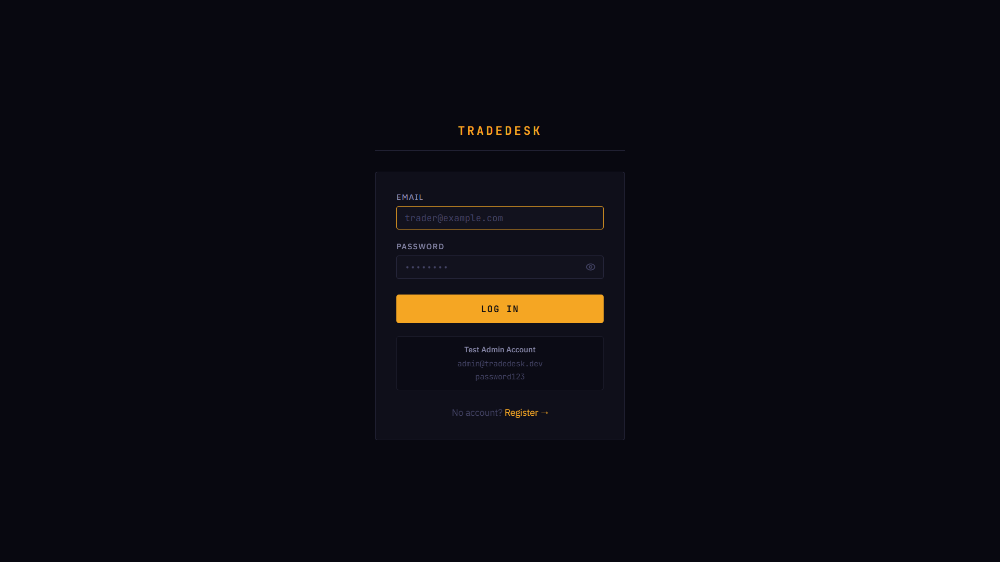
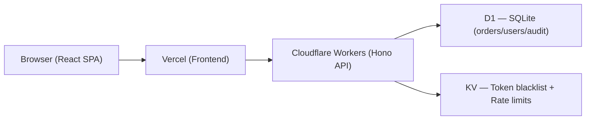

# TradeDesk

A production-grade, full-stack trade order management platform built for the Primetrade.ai internship assignment. TradeDesk demonstrates real engineering maturity across the entire stack: a stateless JWT-authenticated REST API on Cloudflare's serverless edge, role-based access control, an order state machine with immutable audit logs, and a Bloomberg-inspired "Precision Terminal" React frontend.

**Why this stack?** Cloudflare Workers offer zero cold-start serverless compute at 300+ edge locations globally. D1 gives us SQLite-on-edge without managing a database. KV enables sub-millisecond token blacklisting and rate limit counters. Hono.js is the fastest Workers-compatible web framework. React + Vite + shadcn/ui delivers a production-ready frontend with a design system that communicates trust to professional traders.

---

## Live Demos

| Service | URL |
|---|---|
| **Frontend** | https://tradedesk.vercel.app |
| **API** | https://tradedesk-api.REPLACE.workers.dev |
| **API Docs** | https://tradedesk-api.REPLACE.workers.dev/api/docs |

---

## Screenshots

### 1. Trading Dashboard


### 2. Admin Panel (RBAC & State Transitions)


### 3. Order Entry (Drawer)


### 4. Authentication


---

## Architecture



---

## Tech Stack

| Layer | Technology |
|---|---|
| Frontend | React 19 + Vite + Tailwind CSS + shadcn/ui |
| API | Hono.js on Cloudflare Workers |
| Database | Cloudflare D1 (SQLite) |
| Cache / Rate Limit | Cloudflare KV |
| Auth | JWT (Web Crypto API, no libs) + bcryptjs |
| Validation | Zod |
| State | Zustand |
| Deployment | Vercel (frontend) + Cloudflare Workers (API) |

---

## API Routes

### Auth — `/api/v1/auth`
| Method | Path | Auth | Description |
|---|---|---|---|
| POST | `/register` | Public | Register new user |
| POST | `/login` | Public | Login, returns JWT |
| POST | `/logout` | Bearer | Blacklist current token |

### Orders — `/api/v1/orders`
| Method | Path | Auth | Description |
|---|---|---|---|
| GET | `/` | Bearer | List own orders (paginated) |
| POST | `/` | Bearer | Place new order |
| GET | `/:id` | Bearer | Get single order |
| PATCH | `/:id/cancel` | Bearer | Cancel a PENDING order |

### Admin — `/api/v1/admin`
| Method | Path | Auth | Description |
|---|---|---|---|
| GET | `/orders` | Admin | List all orders (filtered) |
| PATCH | `/orders/:id/status` | Admin | Transition order state |
| GET | `/users` | Admin | List all users |
| DELETE | `/users/:id` | Admin | Delete a user |

### System
| Method | Path | Description |
|---|---|---|
| GET | `/api/health` | Health check |
| GET | `/api/docs` | Swagger UI |

---

## Prerequisites

- Node.js 18+
- Wrangler CLI: `npm install -g wrangler`
- Cloudflare account (free tier works)

---

## Local Setup

```bash
# 1. Clone and install all dependencies
git clone <repo-url>
npm install

# 2. Create Cloudflare D1 database
wrangler d1 create tradedesk-db
# → Copy the database_id into backend/wrangler.toml

# 3. Create Cloudflare KV namespace
wrangler kv:namespace create TRADEDESK_KV
# → Copy the id into backend/wrangler.toml

# 4. Create backend/.dev.vars for local secrets
echo 'JWT_SECRET=your_local_secret_here' > backend/.dev.vars

# 5. Run D1 schema migration locally
cd backend
wrangler d1 execute tradedesk-db --local --file=src/db/schema.sql

# 6. Seed admin user (generate bcrypt hash first)
node -e "const b=require('bcryptjs'); b.hash('YourPass123', 12).then(console.log)"
wrangler d1 execute tradedesk-db --local --command "INSERT INTO users (email, password, role) VALUES ('admin@tradedesk.dev', '<hash>', 'admin');"

# 7. Start both servers from root
cd ..
npm run dev
```

Frontend → http://localhost:5173 | API → http://localhost:8787

---

## Environment Variables

| Variable | Location | Description |
|---|---|---|
| `VITE_API_URL` | `frontend/.env.local` | API base URL |
| `JWT_SECRET` | `backend/.dev.vars` (local) / `wrangler secret` (prod) | JWT signing key |
| `JWT_EXPIRY` | `backend/wrangler.toml` [vars] | Token TTL in seconds |
| `DB` | `backend/wrangler.toml` binding | D1 database |
| `KV` | `backend/wrangler.toml` binding | KV namespace |

---

## Deployment

### Backend → Cloudflare Workers

```bash
cd backend

# 1. Create real D1 + KV (if not done)
wrangler d1 create tradedesk-db
wrangler kv:namespace create TRADEDESK_KV
# Update wrangler.toml with the IDs

# 2. Run migrations on remote DB
wrangler d1 execute tradedesk-db --file=src/db/schema.sql

# 3. Set secret
wrangler secret put JWT_SECRET

# 4. Deploy
wrangler deploy
# → Note your workers.dev URL
```

### Frontend → Vercel

```bash
cd frontend

# Option A: Vercel CLI
npx vercel --prod
# Set VITE_API_URL in Vercel dashboard → Project Settings → Environment Variables

# Option B: Vercel Dashboard
# 1. Import GitHub repo
# 2. Set Root Directory = frontend
# 3. Add env var: VITE_API_URL = https://your-worker.workers.dev
# 4. Deploy
```

---

## API Documentation

Swagger UI: `http://localhost:8787/api/docs` (local) or your Workers URL `/api/docs`

---

## Security

- Passwords hashed with bcrypt (12 rounds)
- JWT signed with HMAC-SHA256 (Web Crypto API — no jwt libraries)
- Timing-safe login (bcrypt always runs even for unknown emails)
- Token blacklisting via KV on logout
- CORS restricted to known origins + `*.vercel.app`
- Rate limiting: 10 req/15min (auth), 30 req/min (order create), 200 req/min (general)
- Zod validation on all inputs
- Parameterized D1 queries (no SQL injection)
- `.env` / `.dev.vars` excluded from git

---

## Scalability

See [SCALABILITY.md](./SCALABILITY.md) for detailed notes on horizontal scaling, D1 read replicas, Redis caching, and queue systems.
